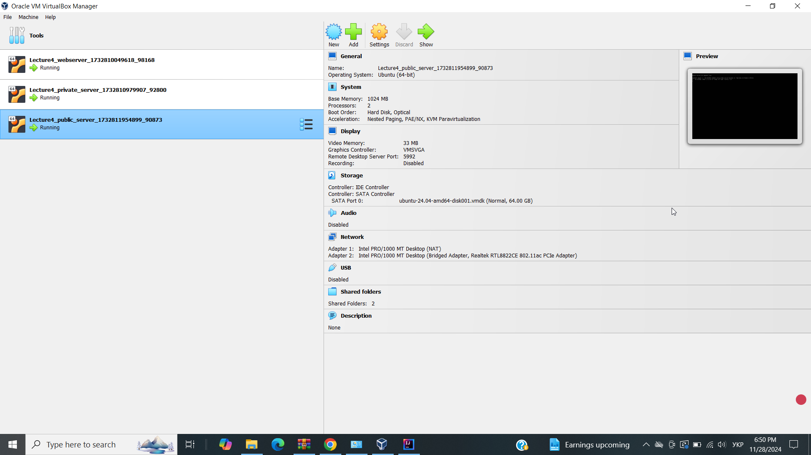

Віртуальні машини піднялися

Щодо створення VM без дублювання коду, то можна це реалізувати так.

Vagrant.configure("2") do |config|
# Тут спільні налаштування
vm_config = {
vm_box: "bento/ubuntu-24.04",
hostname: "ubuntu-vm",
provider_memory: "1024",
provider_cpus: 2,
synced_folder: "./host_folder",
provisioning_script: "./install_packages.sh"
}

# VM1
config.vm.define "webserver" do |vm|
vm.vm.box = vm_config[:vm_box]
vm.vm.hostname = "webserver"
vm.vm.network "public_network", type: "dhcp"
vm.vm.synced_folder vm_config[:synced_folder], "/vagrant_data"
vm.vm.network "forwarded_port", guest: 80, host: 1234
vm.vm.provision "shell", path: vm_config[:provisioning_script]
vm.vm.provider "virtualbox" do |vb|
vb.memory = vm_config[:provider_memory]
vb.cpus = vm_config[:provider_cpus]
end
end

# VM2
config.vm.define "private_server" do |vm|
vm.vm.box = vm_config[:vm_box]
vm.vm.hostname = "private-server"
vm.vm.network "private_network", type: "dhcp", ip: "192.168.56.10"
vm.vm.synced_folder vm_config[:synced_folder], "/vagrant_data"
vm.vm.provision "shell", path: vm_config[:provisioning_script]
vm.vm.provider "virtualbox" do |vb|
vb.memory = vm_config[:provider_memory]
vb.cpus = vm_config[:provider_cpus]
end
end

# VM3
config.vm.define "public_server" do |vm|
vm.vm.box = vm_config[:vm_box]
vm.vm.hostname = "public-server"
vm.vm.network "public_network", ip: "192.168.1.100", bridge: "TP-LINK_A04E"
vm.vm.synced_folder vm_config[:synced_folder], "/home/vagrant/vm_folder"
vm.vm.provider "virtualbox" do |vb|
vb.memory = vm_config[:provider_memory]
vb.cpus = vm_config[:provider_cpus]
end
end

end
